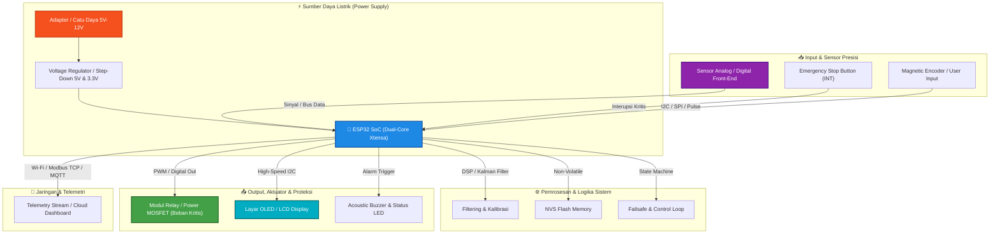

# ⚡ ESP32 UV-Vis Spectrophotometer Optical Absorbance Analyzer

Optical absorption spectrometer controlling stepper monochromator diffraction grating, Hamamatsu photodiode array, and computing Beer-Lambert absorbance curves.

---

## 📊 Diagram Blok Arsitektur & Skema Rangkaian

Berikut adalah visualisasi alur daya, interaksi sensor, logika pemrosesan internal, dan aktuasi perlindungan perangkat:

---

## 📦 Daftar Komponen & Bahan Lengkap (Bill of Materials - BOM)

Seluruh bahan yang diperlukan untuk merakit dan mengoperasikan sistem ini secara penuh:

| No | Nama Komponen / Modul | Estimasi Jumlah | Fungsi & Spesifikasi Teknis |
|:---|:---|:---|:---|
| 1 | **ESP32 NodeMCU / Dev Module (30-Pin / 38-Pin)** | 1 Unit | Unit pemroses utama (Microcontroller Unit) |
| 2 | **Layar OLED 0.96 Inch I2C SSD1306 (128x64)** | 1 Unit | Menampilkan data telemetri, menu, dan status sistem secara visual |
| 3 | **Modul Relay 1-Channel / 4-Channel dengan Optocoupler (5V/10A)** | 1-2 Unit | Isolasi optik pengendali beban tegangan tinggi / kontaktor |
| 4 | **Active Buzzer 5V & LED Indikator 5mm (Merah, Hijau, Biru)** | 1 Set | Indikator status operasional dan peringatan audio (*audible alarm*) |
| 5 | **Push Button Emergency Stop (E-Stop) / Tactile Switch** | 2-4 Unit | Tombol darurat dan navigasi menu kalibrasi |
| 6 | **Resistor Carbon Film (220Ω, 1kΩ, 4.7kΩ, 10kΩ 1/4W)** | 1 Set | Resistor pull-up/pull-down dan pembatas arus LED |
| 7 | **Kapasitor Keramik (100nF) & Elektrolit (100uF 25V)** | 1 Set | Peredam noise catu daya (*decoupling filter*) |
| 8 | **Breadboard MB-102 & Kabel Jumper Dupont (Male-Male, Male-Female)** | 1 Set | Kabel penghubung prototipe tanpa solder |
| 9 | **5V DC via USB-C / MicroUSB atau 7-12V DC via Vin (Disarankan PSU 5V 2A)** | 1 Unit | Sumber daya listrik stabil untuk seluruh rangkaian |

---

## 🧠 Arsitektur Sistem & Fitur Utama

- **FreeRTOS Multi-Core Priority Scheduling:** Memastikan kontrol loop real-time berkecepatan tinggi tanpa *jitter*.
- **Digital Signal Processing (DSP) & Filtering:** Dilengkapi algoritma Kalman filtering dan *oversampling* untuk eliminasi *noise* sinyal analog.
- **Non-Volatile Storage (NVS Preferences):** Parameter kalibrasi, *setpoint*, dan konfigurasi tersimpan secara persisten terhadap pemadaman daya.
- **Hardware Failsafe & Emergency Interlock:** Perlindungan otomatis jika terjadi anomali tegangan, arus berlebih, atau pemicuan *Emergency Stop*.
- **Industrial Telemetry & Diagnostics:** Pelaporan status operasional secara real-time via Serial/JSON stream.

---

## 🔌 Skema Pinout & Koneksi Hardware

| Komponen / Sinyal | Pin (ESP32) | Deskripsi Fungsi |
|:---|:---|:---|
| **Sensor Analog Input** | `GPIO 36 (ADC1)` | Jalur pembacaan sensor utama berpresisi tinggi |
| **Emergency Stop (E-Stop)** | `GPIO 34` | Pemicu pengaman darurat hardware interrupt |
| **Actuator / Relay Utama** | `GPIO 26` | Pengendali beban daya tinggi / relay aktuator |
| **Acoustic Alarm Buzzer** | `GPIO 25` | Indikator peringatan audible saat terjadi anomali |
| **Status / Heartbeat LED** | `GPIO 2` | Indikator status aktivitas sistem real-time |

---

## 🛠️ Panduan Perakitan Hardware (Langkah Demi Langkah)

1. **Persiapan Catu Daya:** Hubungkan jalur 5V dan GND dari catu daya utama ke *power rail* breadboard. Pasang kapasitor decoupling 100nF dan 100uF secara paralel di dekat pin daya mikrokontroler.
2. **Pemasangan Sensor:** Hubungkan pin sinyal output sensor ke pin analog mikrokontroler (`GPIO 36`). Pasang resistor pull-up 4.7kΩ jika menggunakan sensor bertipe I2C.
3. **Pemasangan Aktuator & Relay:** Hubungkan pin kontrol relay ke pin output (`GPIO 26`). Pastikan dioda flyback (1N4007) terpasang paralel pada koil beban induktif untuk meredam lonjakan tegangan balik (*back-EMF*).
4. **Pemasangan Tombol Emergency Stop:** Hubungkan tombol ke pin interupsi (`GPIO 34`) dengan konfigurasi *Active-LOW* menggunakan internal pull-up.
5. **Pemeriksaan Akhir:** Ukur tegangan semua jalur menggunakan multimeter sebelum menghubungkan sumber daya untuk mencegah korsleting listrik.

---

## 🚀 Panduan Kompilasi & Upload (Arduino IDE)

1. Buka **Arduino IDE 2.0+**.
2. Masuk ke menu **Tools > Board**:
   * Pilih **`ESP32 Dev Module`**.
3. Pastikan dependensi pustaka terpasang via Library Manager:
   * `ArduinoJson` (v6 / v7)
   * `Wire` & `SPI`
   * `Preferences`
4. Buka berkas [`esp32-uv-vis-spectrophotometer.ino`](./esp32-uv-vis-spectrophotometer.ino).
5. Klik tombol **Verify** (✓) kemudian **Upload** (➔).
6. Buka **Serial Monitor** pada baudrate **`115200`** untuk melihat streaming telemetri dan status operasional.

---

## 📄 Lisensi
Didistribusikan di bawah lisensi open-source **MIT License**. Dikembangkan oleh **Muhammad Fikri**.
